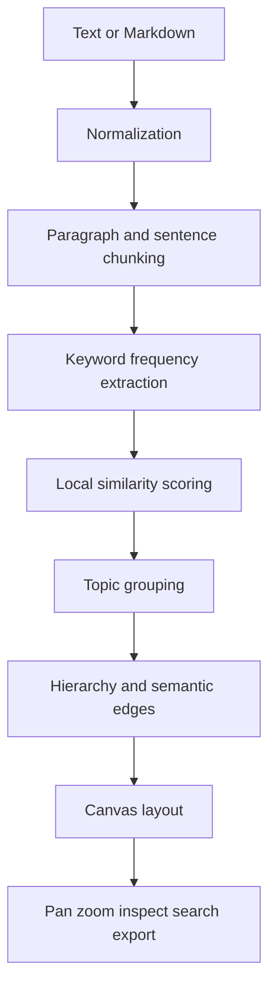

# Architecture

## Current MVP

Exovia NeuroCanvas is intentionally dependency-free so the core concept can run without API credits or installation complexity.



## Data model

A map contains stable node and edge records. Nodes are one of `corpus`, `topic`, or `chunk`. Hierarchical edges connect parent and child nodes; semantic edges connect related source fragments.

The original source is retained on every chunk. The visual graph is therefore an index into evidence, not a lossy replacement for the source.

## Rendering

The browser Canvas API renders nodes and edges in a world coordinate system. Camera state consists of translation and scale. Mouse movement changes translation and the wheel changes scale around the cursor position.

The current implementation uses simple level-of-detail behavior: labels are hidden for small chunk nodes at distant zoom levels. Future versions can add spatial indexing, tile generation and GPU rendering for much larger maps.

## Offline semantic engine

The local engine uses:

- normalized token extraction;
- bilingual stop-word filtering;
- frequency-ranked keywords;
- Jaccard-style token similarity;
- topic grouping by dominant keyword;
- explicit source-text matching for search.

This is deterministic, inexpensive and transparent. It is not claimed to equal model-generated embeddings.

## Optional OpenAI provider

A production architecture should add a server-side provider interface:

```text
SemanticProvider
├── LocalSemanticProvider
└── OpenAISemanticProvider
```

The OpenAI provider can supply embeddings, structured summaries, concept labels and grounded answers. Secrets must remain server-side in `OPENAI_API_KEY`; they must never be shipped to the browser.

## Scaling roadmap

- WebGL renderer and quadtree spatial index
- background workers for ingestion
- SQLite/PostgreSQL persistence
- vector index for semantic retrieval
- deep-zoom tile export
- MCP server and ChatGPT widget
- collaborative projects and access control
